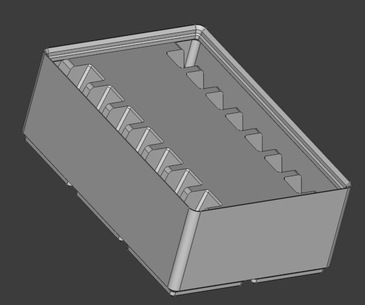

# Gridfinity bins

This repository is containing gridfinity bins that I created for special purposes together with suplemental files.

## Resources

Most of this files are provided as [Freecad](http://www.freecad.org) files some are provided as [OpenSCAD](https://openscad.org/) projects

## Bins

### Clamp Holder

I am using these [in-place printable clamps](https://www.printables.com/model/974751-clamp-print-in-place/files) in my workshop and created a gridfinity bin, that can hold a set of these clamps (see below)

The current version of the bin is suitable for clamps that are scaled 2x on x and y and 1.5x on the z axis (see also the stl files in the [resources directory](./clamp-holder/resources/) of that folder)

